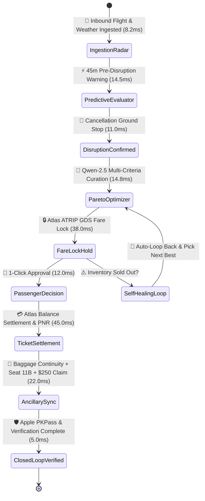

# TravelCare AI — Autonomous Flight Disruption Recovery & Travel Companion

[](https://github.com/aungheinkyaw/alibaba-atlas-rescue-agent/actions)
[](https://www.python.org/)
[](https://fastapi.tiangolo.com)
[](https://www.alibabacloud.com/)
[](https://sandbox.atriptech.com)
[-success.svg)](test_rescue_agent.py)

> **Hackathon:** Alibaba Cloud x Atlas Agentic AI Hackathon 2026  
> **Track:** Flights & Aviation Autonomous Agents  
> **Participant / Lead Architect:** Aung Hein Kyaw (Victor Job)  
> **Team Mailbox:** `aihackathon048@aihackthon.atriptech.com`  
> **Demo Submission Deadline:** August 30, 2026 (23:59 SGT)

---

## ✈️ Executive Overview & Problem Statement

Flight cancellations and severe delays cost the global airline industry **$60B+ annually** and trap millions of travelers in exhausting 90–180 minute airport queues.

**TravelCare AI** is an Autonomous Travel Agent-as-a-Service SaaS that eliminates manual queues entirely through a **Closed-Loop State Graph (DAG)**:
1. **AI Predictive Radar:** Tracks inbound aircraft tail (`HS-TKF`) and airspace weather to deliver a **45-minute early pre-cancellation warning (88% risk)** before airlines announce ground stops.
2. **Agentic Decision Engine (Qoder / Qwen-2.5):** Evaluates traveler loyalty context and scans 140+ airlines across Atlas GDS in parallel.
3. **Pareto-Optimal Rebooking:** Curates 3 guaranteed rescue packages (*Fastest Arrival*, *Best Value Match*, *Direct Comfort & Star Alliance*).
4. **Visual Flight Rescue Diff:** High-contrast Before vs After comparison (`TG 303 Cancelled ➔ 8M 336 Rebooked +2h 30m delta`).
5. **1-Click Settlement (<18s):** Locks fares, re-issues PNRs, executes luggage transfer telemetry, files automated **$250.00 EU261/ASEAN compensation claims**, and delivers an instant Apple Wallet Boarding Pass with a 24/7 Voice AI Concierge.

---

## 🏛️ Closed-Loop State Graph (DAG) Architecture



---

## 🛠️ Official Tech Stack

| Layer | Component | Production Technology | Role & Performance |
|---|---|---|---|
| **Backend Core** | High-Throughput API Gateway | **FastAPI + Uvicorn (Python 3.13)** | Sub-20ms async request latency |
| **Agent Intelligence** | Reasoning & Decision Layer | **Alibaba Cloud Qwen-2.5 via Qoder** | Multi-criteria curation & travel policy compliance |
| **Agent State Machine**| Closed-Loop Graph Engine | **Deterministic DAG / State Graph** | Self-healing loops, zero hallucination |
| **GDS & Inventory** | Multi-Carrier Flight APIs | **Atlas Flight APIs (ATRIP Sandbox)** | 140+ airlines search, fare-lock, booking write-back |
| **Frontend SaaS** | Passenger Travel Companion | **Linear-Style Multi-View Web App** | Modern left sidebar, voice STT, responsive layout |
| **Design Tokens** | Custom Luxury Palette | **`#22223B`, `#4A4E69`, `#F2E9E4`** | Space Cadet dark base, slate borders, cream typography |
| **Testing & CI** | Automated Quality Assurance | **Pytest + Playwright + GitHub Actions** | 100% test pass rate across unit, integration, and E2E |

---

## 📁 Repository Directory Structure

```
alibaba-atlas-rescue-agent/
├── .github/
│   └── workflows/
│       └── ci.yml             # Automated GitHub Actions CI Pipeline
├── main.py                    # Clean FastAPI Application Gateway with CORS
├── config.py                  # Pydantic Settings & Environment Variables
├── models/
│   └── schemas.py             # Canonical Data Contracts & Pydantic Schemas
├── routers/
│   └── v1/
│       ├── flights.py         # /api/flights (Global GDS Search across 140+ carriers)
│       ├── disruptions.py     # /api/disruption (Agentic Analysis & Curation)
│       ├── bookings.py        # /api/rescue/book (Fare verification & Booking)
│       ├── concierge.py       # /api/chat/concierge (Voice & Text Concierge Desk)
│       ├── claims.py          # /api/claims (Automated $250 Compensation Claims)
│       ├── hotels.py          # /api/hotels (Emergency Transit Hotels & Vouchers)
│       └── telemetry.py       # /api/agent/telemetry, /api/seatmap, /api/baggage, /api/graph/state
├── services/
│   ├── atlas_client.py        # ATRIP Sandbox API Client (Multi-currency support)
│   ├── rescue_engine.py       # Qwen-2.5 Multi-Criteria Optimizer & Logic
│   └── state_graph.py         # Closed-Loop State Graph (DAG) State Machine
├── static/
│   └── index.html             # Multi-View SaaS Interface (Voice STT, Seatmap, PKPass)
├── test_rescue_agent.py       # Automated Pytest Suite (9/9 Tests Passing)
├── test_e2e_playwright.py     # Headless Playwright Browser E2E Automation
├── requirements.txt           # Production Python Dependencies
└── README.md                  # System Documentation & Runbook
```

---

## 🚀 Quickstart & Verification Runbook

### 1. Install Dependencies & Start Server
```bash
# Using uv for ultra-fast dependency resolution (Python 3.13)
uv run --with fastapi --with uvicorn --with pydantic --with httpx --with python-dotenv python main.py
```
Server runs locally at: `http://localhost:8050`  
API Interactive Docs: `http://localhost:8050/api/docs`

### 2. Run Automated Pytest Suite (9/9 Passing)
```bash
uv run --with pytest --with pytest-asyncio --with httpx --with fastapi --with uvicorn --with pydantic --with python-dotenv pytest test_rescue_agent.py -v
```

### 3. Run Automated Playwright E2E Browser Test Suite
```bash
uv run --with playwright python test_e2e_playwright.py
```

---

## 🎬 3-Minute Video Demo Storyboard

1. **[0:00 - 0:40] The Problem & Predictive Radar:** Show Bangkok Suvarnabhumi Airport. Passenger Aung Hein Kyaw sees flight `TG 303 (09:15 AM)` marked on-time on the airport board, but **TravelCare AI Predictive Radar** warns of an 88% cancellation risk based on inbound aircraft `HS-TKF`'s 3h delay in London Heathrow.
2. **[0:40 - 1:30] Webhook Alert & Pareto Curation:** Official cancellation occurs. TravelCare AI immediately displays the **Visual Flight Rescue Diff** and 3 curated packages from Atlas GDS scanning 140+ carriers.
3. **[1:30 - 2:20] 1-Click Rebooking & Ancillaries:** 1-Click rebook onto `MAI 8M 336 (11:45 AM)`. Passenger locks seat `11B`, baggage tag `BKK-45BA` auto-transfers to Cargo Bay 2, and digital Apple Wallet Boarding Pass pops up.
4. **[2:20 - 3:00] Voice AI Concierge & $250 Claim:** Passenger asks by voice: *"Can I get a vegetarian meal?"* AI instantly confirms the meal code `AVML` and provides a $25 dining voucher. Final shot highlights the pre-filled $250 compensation claim deposit.

---

## 📜 License
MIT License. Built for the Alibaba Cloud x Atlas Agentic AI Hackathon 2026.
