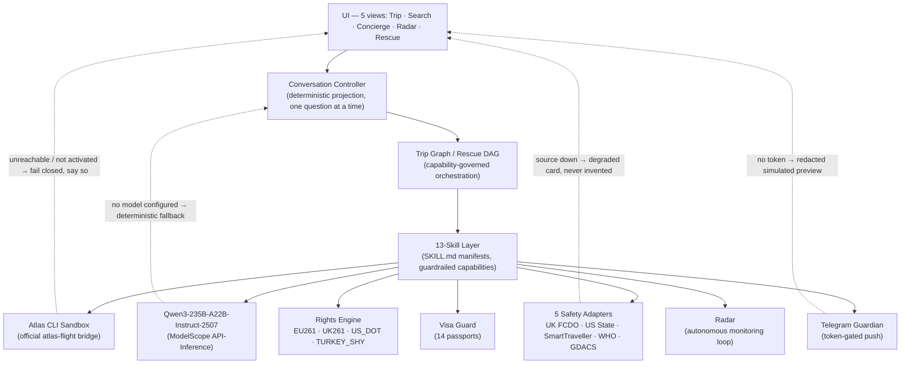

# TravelCare AI

**One travel goal. A complete, safety-aware journey — planned, watched, and rescued by an autonomous agent.**

[](https://www.python.org/)
[](https://fastapi.tiangolo.com)
[](https://www.modelscope.cn/)
[-0F766E.svg)](https://sandbox.atriptech.com)
[](tests/)
[](https://qoder.com)


---

## The Problem

Roughly **EUR 5.9B per year** in EU261 compensation goes unclaimed, and airlines **wrongfully reject ~52%** of valid claims by citing "extraordinary circumstances". When a flight breaks, rebooking tools happily route passport-constrained travelers through countries they cannot even transit — visa-impossible rebookings that strand people a second time. Travelers need one agent that plans the whole trip, watches it, rescues it honestly, and fights for the compensation that is legally owed.

## The Solution

**TravelCare AI** is an autonomous travel agent: one natural-language goal becomes a complete, safety-aware journey. A deterministic conversation controller asks exactly one clarifying question at a time; a capability-governed trip graph orchestrates 13 guardrailed skills; Qwen3-235B (via ModelScope) parses intent and classifies disruption causes; and every external fact comes from a real, named tool — never invented.

**One brain, five views:**

- **Trip** — goal intake, clarification, full plan (flights, entry requirements, safety card) with an explicit approval gate
- **Search** — live Atlas Sandbox flight search, never cached
- **Concierge** — Qwen3-235B chat grounded in your live trip context
- **Radar** — continuous monitoring of watched flights with early alerts and one-click handoff to rescue
- **Rescue Hub** — observable recovery planning with visa-safe packages and Claims Autopilot

**What makes it different:**

- **Capability-governed trip graph with 13 guardrailed skills** — each skill ships a machine-readable `SKILL.md` manifest parsed at boot; capabilities are declared, not assumed
- **Visa-aware rescue ranking across 14 passports** (`services/visa_guard.py`) — rescue options that would create a visa problem are demoted or blocked, flagging RISK over CLEAR
- **Fail-closed honesty** — the agent never fabricates a PNR, route, jurisdiction, or payout; unreachable safety sources say so; ticketing reports `TICKETING_ACTIVATION_REQUIRED` instead of inventing an order
- **Claims Autopilot** — deterministic rights engine resolves EU261 / UK261 / US DOT / Turkey SHY jurisdiction from the real route, computes the fixed entitlement, and drafts regulation-cited claim and appeal letters

## Architecture



Deterministic engines (rights engine, visa guard, radar) run the consequential decisions; the LLM handles intent parsing, clarification, and cause classification. Every external boundary either returns provider truth or fails closed with an explicit reason.

## Built With — How We Used the Available Tools

| Tool | How TravelCare AI uses it | Where in code |
|---|---|---|
| **Atlas Travel Sandbox (official `atlas-flight` CLI)** | The only flight-data source. Live search, offer verification, and the fail-closed booking path run through the authenticated CLI bridge — never cached or product-coded offers. Ticketing honestly reports `TICKETING_ACTIVATION_REQUIRED`. | `services/atlas_client.py`, `services/skills/flight_search.py`, `services/skills/flight_book.py` |
| **Qwen3-235B-A22B-Instruct-2507 via ModelScope API-Inference** | Parses the traveler's goal into structured intent, drives one-question-at-a-time clarification, powers the Concierge, and classifies disruption causes for Claims Autopilot. Deterministic fallback when no model is configured. | `services/llm.py`, `services/conversation_controller.py`, `routers/v1/concierge.py` |
| **Qoder platform** | The agentic development platform used to build and orchestrate the project: iterative agent-driven implementation, test-first cycles, and multi-step build orchestration across the 661-test suite. | Whole repository; build history in `docs/MASTER_BUILD_PACKAGE.md` |
| **Safety adapters (UK FCDO, US State, SmartTraveller, WHO, GDACS)** | Five fail-closed adapters compose the destination safety card in every completed plan; an unreachable source degrades the card honestly instead of being silently dropped. | `services/safety/adapters.py`, `services/safety/policy.py` |
| **Rights engine (EU261 / UK261 / US_DOT / TURKEY_SHY)** | Deterministic jurisdiction resolution from the actual route, distance-band entitlement computation, and regulation-cited claim/appeal letter drafting. | `services/rights_engine.py`, `services/skills/rights_check.py` |
| **Visa guard (14 passports)** | Conservative curated visa table ranks and filters rescue options so no rebooking creates a visa problem; flags RISK over CLEAR. | `services/visa_guard.py`, `services/skills/visa_check.py` |
| **Playwright + pytest** | 661 tests: provider-boundary truth, privacy, claims truth, UI journeys, V2 parity gates, and Playwright browser canaries — hermetic test doubles by default; with LLM keys present the qwen-brain suites exercise the live provider, and without keys they exercise the deterministic fallback. | `tests/` |
| **Telegram Guardian** | Proactive disruption push; live delivery requires token + chat ID + explicit live-test opt-in, otherwise returns a redacted simulated preview. | `services/guardian.py`, `services/skills/guardian_push.py` |

## Demo

🎬 **[Watch the 3-minute demo on YouTube](https://youtu.be/H-MC2JHWl7M)**

The recorded demo is a genuine, continuous screen capture of the running application — every number shown is produced live by real tools, never mocked or scripted. The eight sections below are synced to the video markers.

| # | Time | Section | What you see |
|---|---|---|---|
| 1 | 0:00 | **Hook** | TravelCare AI overview — plan, watch, rescue. One brain, five views: Trip, Search, Concierge, Radar, Rescue |
| 2 | 0:26 | **Trip intake & Qwen parsing** | One natural-language goal → Qwen3-235B parses intent and asks exactly one clarifying question at a time (dates, passengers, passport) while the capability-governed trip graph orchestrates the 13 guardrailed skills |
| 3 | 0:53 | **Atlas Sandbox options + safety card** | Flight options stream from the Atlas Sandbox via the official `atlas-flight` CLI, each with provenance and reference-price chips; the completed plan adds entry requirements and a fail-closed safety card (UK FCDO, US State, SmartTraveller, WHO, GDACS) |
| 4 | 1:19 | **Approval gate & privacy** | Nothing books without explicit approval; the gate shows the sandbox truth — ticketing is not activated, so the flight stays *planned*, not booked. Profile drawer masks every document; consent preferences govern storage |
| 5 | 1:39 | **Search + Radar** | The Search view drives the same Atlas Sandbox live (never cached), while Radar scans monitored flights, raises early alerts, and hands off to rescue in one click |
| 6 | 1:58 | **Concierge** | Qwen3-235B free-text chat grounded in the live trip context, with quick-action chips for rights, visa, and rebooking questions |
| 7 | 2:15 | **Rescue Hub** *(explicitly labeled demo simulation)* | Add a flight, trigger the clearly labeled explicit demo simulation → observable reasoning trail, visa-safe rescue packages ranked across 14 passports, fare-lock countdown, one-click rebook, Telegram Guardian push in demo mode |
| 8 | 2:36 | **Claims Autopilot + close** | EU261 regime detected, disruption cause classified by Qwen, fixed cash entitlement computed, evidence pack + claim letter + appeal drafted automatically |


## Quickstart

**Prerequisites:** Python 3.13, the official `atlas-flight` CLI (`atlas-flight auth login` for one-time Sandbox auth), optionally a ModelScope API key for the Qwen3-235B engine.

```bash
# 1. Configure
cp .env.example .env            # add ALIBABA_MODEL_API_KEY for live Qwen (optional; deterministic fallback otherwise)

# 2. Install & run
python3.13 -m venv .venv && .venv/bin/pip install -r requirements.txt
atlas-flight auth login         # one-time Atlas Sandbox authentication
.venv/bin/python main.py        # → http://localhost:8050

# 3. Verify
.venv/bin/python -m pytest -q   # 661 tests
```

> **V2 (Qwen-Agent brain, experimental):** the strangler-fig Qwen-Agent
> brain lives behind the `TRAVELCARE_BRAIN` flag (default `legacy`) and has
> its own pinned dependency set — install it ON TOP of the base set:
>
> ```bash
> .venv/bin/pip install -r requirements.txt -r requirements-v2.txt
> ```
>
> `requirements-v2.txt` pins `qwen-agent==0.0.34` plus every runtime
> dependency the qwen brain imports. If the package is absent while
> `TRAVELCARE_BRAIN=qwen_agent`, the app serves a labeled legacy fallback
> instead of erroring. Details: `docs/V2_STATUS.md`.

## Verification & Testing

**661 pytest tests** (green under BOTH `TRAVELCARE_BRAIN=legacy` and `TRAVELCARE_BRAIN=qwen_agent`) — external boundaries are replaced by test doubles by default, so the suite never touches Atlas, ModelScope, or Telegram; with LLM provider keys in the environment the qwen-brain suites additionally exercise the live provider.

| Suite | Proves | Key files |
|---|---|---|
| Provider-boundary truth | Atlas search/verification comes only from the CLI bridge; no product-coded fallbacks | `tests/test_atlas_sandbox_only.py`, `tests/test_atlas_search_semantics.py` |
| Privacy | No non-consented PII; profile masking and consent gates | `tests/test_privacy.py`, `tests/test_profile_store.py`, `tests/test_provider_log_redaction.py` |
| Claims truth | Verdicts and payouts derive from provider route truth; missing routes fail closed | `tests/test_claims_provider_truth.py`, `tests/test_rights_and_visa.py` |
| Playwright UI journeys | Real-browser end-to-end flows across the five views | `tests/test_e2e_trip_journey.py`, `tests/test_ui_trip.py` |
| Capability boundary | Ticketing fails closed with `TICKETING_ACTIVATION_REQUIRED`; no fabricated PNR | `tests/test_ticketing_capability_boundary.py`, `tests/test_skills_manifest.py` |

```bash
.venv/bin/python -m pytest -q                 # full hermetic suite (535 tests)
bash scripts/security_check.sh                # secret-scan gate; reports only tools it actually runs
```

## Honesty & Data Boundaries

Atlas organizers confirmed (2026-08): *"We did not prepare a separate 'Hackathon Dataset' … You can directly use the Sandbox data to complete and demonstrate your project."*

| Layer | State |
|---|---|
| Conversation Controller | Pure deterministic projection (`services/conversation_controller.py`); at most one active question; safety and approval gates take priority; no PII collected |
| Flight search & fares | Official Atlas Sandbox through the authenticated `atlas-flight` CLI; exact-airport results only, with provider `price_status` and `bookable` truth preserved |
| Booking & ticketing | Fail-closed Sandbox order path with an explicit capability boundary. This account reports `TICKETING_ACTIVATION_REQUIRED`; no PNR or ticket is fabricated |
| LLM reasoning | Qwen3-235B-A22B-Instruct-2507 via ModelScope API-Inference; deterministic fallback when no model is configured |
| Rights engine | Deterministic rule tables grounded in published regulations (EU261, UK261, US DOT, Turkey SHY) |
| Visa rules | Conservative curated table across 14 passports (2026-08); flags RISK over CLEAR |
| Safety card | Five fail-closed adapters (UK FCDO, US State, SmartTraveller, WHO, GDACS); unreachable sources degrade the card honestly |
| Telegram Guardian | Live push requires `TELEGRAM_BOT_TOKEN` + `TELEGRAM_CHAT_ID` + `TELEGRAM_LIVE_TEST=true`; returns redacted simulated preview otherwise |
| Disruption rescue, transit hotels, care vouchers, baggage, seatmap, predictive radar | Explicitly labeled demo simulation only; never a provider fallback |
| `GET /api/graph/state` | Canned replay (`mode=demo_replay`); live DAG trace ships inside every analyze response |

**In one sentence:** TravelCare AI runs on the real Atlas Sandbox only, labels every simulation, keeps ticketing deactivated (no bookings, no payments), fabricates nothing, and never stores non-consented PII.

## Repository Structure

```
alibaba-atlas-rescue-agent/
├── main.py                        # FastAPI app, lifespan radar loop, health
├── config.py                      # Pydantic settings (.env-driven)
├── models/schemas.py              # Pydantic contracts (no fake defaults)
├── routers/v1/
│   ├── flights.py                 # POST /api/flights/search
│   ├── disruptions.py             # POST /api/disruption/analyze, /self-heal
│   ├── bookings.py                # POST /api/rescue/book
│   ├── concierge.py               # POST /api/chat/concierge
│   ├── claims.py                  # POST /api/claims/assess, /appeal
│   ├── hotels.py                  # transit hotels + care vouchers
│   ├── radar.py                   # watchlist, scan, SSE stream
│   ├── telemetry.py               # baggage, seatmap, predictive radar, graph replay
│   ├── trip.py                    # trip-goal conversation endpoints
│   ├── profile.py                 # consent-gated profile store
│   └── skills.py                  # skill registry introspection
├── services/
│   ├── conversation_controller.py # deterministic one-question-at-a-time projection
│   ├── trip_graph.py              # capability-governed trip orchestration
│   ├── rescue_engine.py           # rescue DAG orchestration, package curation
│   ├── state_graph.py             # closed-loop DAG state recorder
│   ├── atlas_client.py            # strict atlas-flight CLI boundary
│   ├── llm.py                     # Qwen3-235B via ModelScope API-Inference
│   ├── rights_engine.py           # EU261 / UK261 / US_DOT / TURKEY_SHY
│   ├── visa_guard.py              # 14-passport visa-aware ranking
│   ├── radar.py                   # autonomous monitoring loop
│   ├── guardian.py                # token-gated Telegram push
│   ├── profile_store.py           # consent-governed masked profile
│   ├── readiness.py               # startup capability/readiness checks
│   ├── research_coordinator.py    # bounded web research coordination
│   ├── web_intel_client.py        # web intel boundary
│   ├── skills/                    # 13 registered skills + SKILL.md manifests
│   │   ├── goal_intake.py · clarify_loop.py · location_resolve.py
│   │   ├── flight_search.py · flight_book.py · visa_check.py
│   │   ├── itinerary.py · safety-related skills · rights_check.py
│   │   ├── disruption_monitor.py · recovery_plan.py
│   │   ├── guardian_push.py · profile_capture.py · profile_edit.py · web_intel.py
│   │   └── *.SKILL.md             # machine-readable capability manifests
│   └── safety/
│       ├── adapters.py            # UK FCDO · US State · SmartTraveller · WHO · GDACS
│       └── policy.py              # fail-closed safety card policy
├── static/
│   ├── index.html                 # 5 views: Trip · Search · Concierge · Radar · Rescue
│   ├── app.js · trip.js           # vanilla JS front-ends
│   └── styles.css
├── tests/                         # 535 hermetic pytest tests (incl. Playwright)
├── scripts/security_check.sh      # secret-scan gate
├── screenshots/ · e2e_screenshots/# captured evidence assets
├── docs/MASTER_BUILD_PACKAGE.md   # full build narrative
└── FINAL_REPORT.md                # evidence, blockers, honest limitations
```

## Honest Limitations

- The Atlas CLI exposes search and offer verification but **no flight-status command**, so real disruption recovery fails closed until a trusted status source exists.
- The authenticated Sandbox account reports `TICKETING_ACTIVATION_REQUIRED`; booking also needs an approved ephemeral traveler-data flow, so **no booking or PNR is claimed today**.
- Trip state and active watches are **in-process**; multi-instance persistence is outside the local single-user architecture. Authentication and multi-tenancy are not part of this product.
- **LLM, web-research, and Telegram integrations are optional** and are not proven by the hermetic suite.
- Optional scanners may be absent; `scripts/security_check.sh` reports only the tools it actually runs.

## License & Contact

MIT License.

Deeper reading: [FINAL_REPORT.md](FINAL_REPORT.md) · [docs/MASTER_BUILD_PACKAGE.md](docs/MASTER_BUILD_PACKAGE.md)

---

## V2 — Qwen-Agent Brain Swap (in progress)

> **Branch:** `v2/qwen-agent-migration` · **Flag:** `TRAVELCARE_BRAIN=qwen_agent` · **Status:** feature-complete, pending owner review

The V2 migration replaces the monolithic conversation controller with a **Qwen-Agent `Assistant`** backed by 17 registered tools — each wrapping an existing deterministic skill or engine (strangler-fig pattern). Both `legacy` and `qwen_agent` brains coexist behind the `TRAVELCARE_BRAIN` environment variable; the legacy path remains fully functional and is the default.

**Key additions:** dual-provider fallback (ModelScope → OpenRouter), full tool registry covering all 13 public skills + 4 internal engines, 574 hermetic tests green on both flags, and a dual browser canary (14/14) on both flags.

See [`docs/V2_STATUS.md`](docs/V2_STATUS.md) for the full evidence table and [`docs/V2_LEARNINGS.md`](docs/V2_LEARNINGS.md) for the engineering log.
